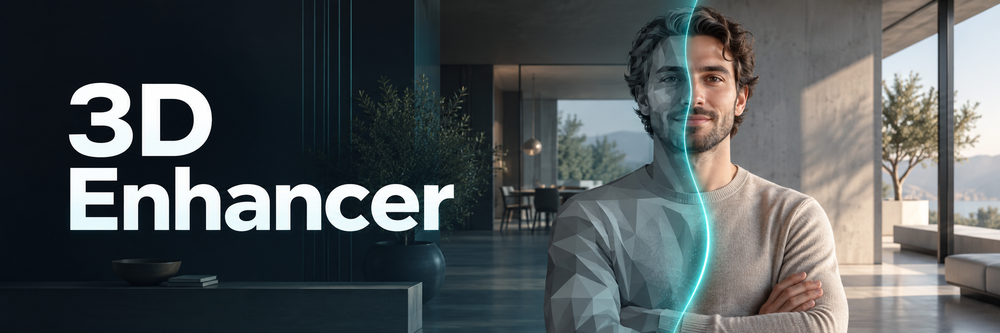

# 3D Enhancer



*Read this in [Spanish / Español](README.es.md).*

Python and PyQt5 desktop application that sends complete renders to GPT Image 2 or GPT Image 2.5 (Sunburst) to replace their 3D characters with photographic people, preserving the scene and the composition.

## Demo

A basic video demonstration of the application in action and the generated result.

[Watch the demo (MP4)](demos/demo_1.mp4)

### Before and after

Comparison of the original render and the result generated with **GPT Image 2.5** in 3D Enhancer. Click either image to view it at full size.

| Before · Original render | After · GPT Image 2.5 |
| :---: | :---: |
| [](demos/demo.webp) | [](demos/demo_3denhancer.webp) |

## What it includes

- English and Spanish interface, with system language detection and a selector at the top for switching languages instantly.
- Multiple selection of images, folders, and drag and drop.
- Full-image editing with a model selector: `gpt-image-2` or `gpt-image-2.5-sunburst`, both with `quality="high"`. The selection is remembered; GPT Image 2 remains the default.
- Editable restrictive prompt to preserve the number, position, scale, pose, and clothing of each character, as well as architecture, text, lighting, and camera.
- Configurable processing of one to five simultaneous images.
- Detection of existing results with the option to skip or reprocess them without overwriting files.
- Per-image status, progress, cancellation, log, and original/result preview.
- Click a preview to open a comparison viewer with a before/after slider, zoom up to 800%, panning, and full screen.
- Output directory and persistent settings through `QSettings`.

Each processed image makes an independent API call.

## Interface language

The **Language** selector at the top offers **System**, **Español**, and **English**. Changes take effect immediately and are remembered for the next launch, even when switching during batch processing. Images, previews, settings, and progress are preserved.

**System** is the default: it uses the operating system's primary display language. Spanish systems, including regional variants such as Spain and Mexico, use Spanish; English and other system languages use English. Select this option again to return to automatic detection.

Buttons, tooltips, dialogs, progress messages, and the log use the selected language. The default editing prompt remains in English in both interfaces. Changing the interface language does not translate custom prompts or file paths.

## Installation

Python 3.11 or 3.12 is recommended.

```powershell
python -m venv .venv
.\.venv\Scripts\Activate.ps1
python -m pip install --upgrade pip
pip install -r requirements.txt
```

The OpenAI key is entered directly in the top right of the application. **The API key is stored encrypted locally on your computer**, using DPAPI on Windows or the macOS Keychain, bound to the current user. It is never stored in plain text, no `.env` file is created, and the key is never included in the project.

## Usage

```powershell
python main.py
```

On Windows you can also open `run_app.bat`.

If you use the packaged Windows version, open `release/windows/3D Enhancer.exe`.

1. Enter the OpenAI key and press **Save API key**. This is only necessary the first time or when changing it.
2. Add images, a complete folder, or drag the renders onto the window.
3. Select a shared output directory or check **Save next to each input image**. When checked, each result is saved in its original image's folder, even if the batch contains images from different folders. The shared directory is disabled and the preference is remembered; unchecking restores the previous shared directory.
4. Choose **GPT Image 2** or **GPT Image 2.5 (Sunburst)** in **Image model**, directly below the output directory.
5. Optionally open **Advanced settings** to change the number of simultaneous images or the prompt.
6. Press **Process images**.
7. Click the original or result preview to inspect the image in the [before and after viewer](#before-and-after-viewer). You can open it while processing continues.

These steps use the labels shown in the English interface. For the Spanish labels, see the [Spanish README](README.es.md).

If results already exist, the application asks once whether they should be skipped or reprocessed. When reprocessing it keeps the previous ones and creates names such as `render_01_humanized_2.png`, `render_01_humanized_3.png`, and so on.

## Choosing the image model

| Option in the application | API model ID | Default |
| --- | --- | --- |
| GPT Image 2 | `gpt-image-2` | Yes |
| GPT Image 2.5 (Sunburst) | `gpt-image-2.5-sunburst` | No |

The GPT Image 2.5 option uses the Sunburst variant. Both options edit the complete render with the same prompt and high quality (`quality="high"`).

The selected model applies to every image in the next batch. The selector is disabled during processing, and the active model appears in the progress details and batch log. The application saves the selection when processing starts or the window closes, and restores it on the next launch.

To compare both models on the same render, finish the first batch, change the model, and process the image again. Choose **Reprocess and rename** when asked about existing results. Previous outputs are preserved; changing models does not automatically reprocess existing images.

## Building the desktop applications

The icon and the PyInstaller configuration are already included. Binaries must be built on their own operating system; PyInstaller cannot reliably create a macOS application from Windows.

Windows, from PowerShell:

```powershell
.\build_windows.ps1
```

Result: `release/windows/3D Enhancer.exe`.

macOS, from Terminal:

```bash
chmod +x build_macos.command
./build_macos.command
```

Result: `release/macos/3D Enhancer.app`.

### Download a macOS build from GitHub Actions

The [Build macOS app workflow](https://github.com/crazyramirez/3DEnhancer/actions/workflows/build-macos.yml) builds native apps for **Apple Silicon (arm64)** and **Intel (x86_64)** using Python 3.12 on macOS 15. It runs when app, test, or build files change on `main` or in a pull request, when a `v*` tag is pushed, or manually with **Run workflow**.

1. Open **Actions → Build macOS app** and select a successful run, or click **Run workflow** to start one.
2. Under **Artifacts**, download `3DEnhancer-macos-arm64.zip` for a Mac with an Apple M-series chip, or `3DEnhancer-macos-x86_64.zip` for an Intel Mac. Check **About This Mac** if unsure.
3. Extract the ZIP, drag **3D Enhancer.app** to **Applications**, and open it. Python does not need to be installed.

Downloads are kept for 30 days. Each build runs the tests without API calls, verifies the bundle architecture, and checks that the packaged app stays running during a brief startup check. These builds are tested on macOS 15; compatibility with older macOS versions is not verified.

The app is not signed with an Apple Developer ID or notarized. If macOS blocks opening a build you trust, follow [Apple's instructions](https://support.apple.com/en-us/102445): after attempting to open it, use **System Settings → Privacy & Security → Open Anyway**. Distribution without this exception requires Developer ID signing and notarization; the workflow does not require Apple credentials or an OpenAI API key.

## Generated files

For `render_01.jpg` the file `render_01_humanized.png` is created. Reprocessed images use numeric suffixes and never overwrite an existing result.

With **Save next to each input image** enabled, existing results are checked in each original image's folder. Skipping or reprocessing and renaming also work in this mode.

## Before and after viewer

Click a loaded preview or **Open viewer** to open the comparison above the application. You can also focus the preview with the keyboard and press **Enter** or **Space**. The viewer keeps the original and its result aligned, with **Original**, **Compare**, and **Result** modes.

In **Compare** mode, the original appears on the left and the result on the right. Zoom and panning move both images together, so you can compare the same detail at up to **800%** magnification.

| Action | Control |
| --- | --- |
| Reveal before and after | Drag the divider on the image or the slider below it. |
| Adjust the comparison with the keyboard | Focus the slider and use the arrow keys; **Home** and **End** move it to either edge. |
| Center the divider | Click **50 / 50**. |
| Zoom into a detail | Scroll over that point, use the **+** and **−** buttons, or press **+** / **−**. |
| Pan a zoomed image | Drag the image; over the divider, hold **Space** or use the middle mouse button. |
| Fit the image to the viewer | Click **Fit** or press **0**. |
| View at 100% | Click **100%** or press **1**; double-click to toggle between 100% and fit. |
| Full screen | Click **Full screen** or press **F**. |
| Exit | **Esc** exits full screen; press it again to close the viewer. **Close** closes it directly. |

If the result is not available yet, you can explore the original. Its comparison appears automatically when processing finishes, without resetting the zoom. The viewer stays on the image you opened while the batch continues with other images. Opening it does not modify files or use the API.

## Recommended settings

- The default value processes up to five simultaneous images. Reduce it if the account hits temporary API limits.
- The default prompt avoids emphasizing faces or hair and requires preserving head size, silhouette, pose, clothing, and occlusions.
- Distant faces are requested with moderate detail to avoid oversized or invented features.
- Cancelling stops the following groups after the active calls finish.

## Verification without consuming the API

```powershell
python -m unittest discover -s tests -v
python -m compileall -q main.py renderhuman tests
```

The tests use a fake client and make no external requests. They cover both models, forwarding the selected model to the image API, saving and restoring the selection, and disabling the selector during processing, as well as image handling, credentials, and parallel processing.

Language tests also cover system language detection, regional variants, the English fallback, live switching during processing, the saved preference, and translation of progress, dialogs, and logs without changing user data.

Viewer tests cover the rendered before/after split, synchronized controls, zoom centered on the pointer, panning limits, full screen, keyboard shortcuts, EXIF orientation, unreadable files, and results arriving while the viewer is open.

## Technical notes

The integration follows the [official OpenAI image generation and editing guide](https://developers.openai.com/api/docs/guides/image-generation). A normalized PNG copy of the complete render is sent. Preserving the scene depends on prompt adherence and is not a mathematical pixel lock.

The key is never displayed again and is stored encrypted locally: Windows uses DPAPI and macOS uses its Keychain. Changing user or reinstalling the system requires entering it again.

Review your project's privacy requirements and the current API terms of use before processing confidential material or distributing the application.
